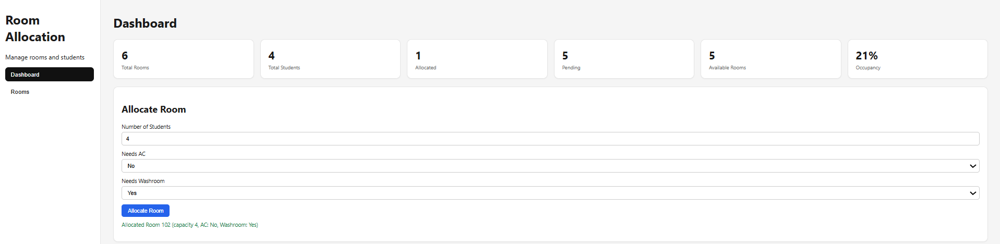
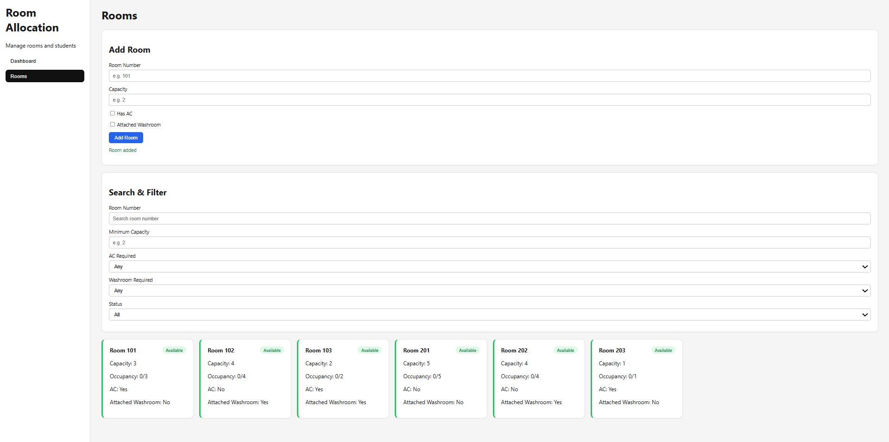

# Hostel Room Management

A React + Vite web app for hostel administrators to manage rooms and automatically allocate the smallest suitable room to incoming students based on capacity, AC, and attached-washroom requirements.

## Features

- **Add Room** - create rooms with a room number, capacity, AC flag, and attached-washroom flag.
- **Room validation** - require a room number, prevent duplicate room numbers, and require a positive capacity.
- **View Rooms** - browse responsive room cards showing capacity, occupancy, amenities, and status.
- **Search and Filter** - filter rooms by room number, minimum capacity, AC, attached washroom, and status.
- **Allocate Room** - assign students to the smallest room that satisfies the capacity and amenity requirements.
- **Dashboard stats** - view total rooms, total students, allocated rooms, pending rooms, available rooms, and occupancy percentage.
- **Persistence** - rooms and occupancy are saved to browser `localStorage` and restored after refreshes.

<p align="center">
   <br /><em>Dashboard view — stats cards and the Allocate Room panel</em>
  
  <br />
  <em>Room view — Add room, search and filter them  </em>
	<br />
	


	<video width="640" height="360" controls poster="./src/Asset/dashboard.png">
		<source src="./src/Asset/hostel-room-allocation-1bsbybwv_lMTOByRU.mp4" type="video/mp4">
		<a href="./src/Asset/hostel-room-allocation-1bsbybwv_lMTOByRU.mp4">Watch the demo video</a>
	</video>
</p>

## How Allocation Works

The `allocateRoom` function in [`src/allocate.js`](src/allocate.js) is pure. It filters out rooms without enough free space or required amenities, then selects the smallest remaining room.

```js
export function allocateRoom(rooms, students, needsAC, needsWashroom) {
	const candidates = rooms.filter((room) => {
		const freeSpace = room.capacity - room.occupied

		return (
			freeSpace >= students &&
			(!needsAC || room.hasAC) &&
			(!needsWashroom || room.hasAttachedWashroom)
		)
	})

	if (candidates.length === 0) return null

	candidates.sort((a, b) => a.capacity - b.capacity)
	return candidates[0]
}
```

If no room qualifies, the dashboard displays `No room available`.

## Data Model

Each room is stored with the following fields:

| Field | Type | Description |
| --- | --- | --- |
| `roomNo` | `string` | Unique room identifier |
| `capacity` | `number` | Maximum number of students the room can hold |
| `hasAC` | `boolean` | Whether the room has AC |
| `hasAttachedWashroom` | `boolean` | Whether the room has an attached washroom |
| `occupied` | `number` | Number of students currently assigned; starts at `0` |

Room status is derived from occupancy rather than stored:

- `occupied === 0` - Available
- `0 < occupied < capacity` - Partial
- `occupied === capacity` - Full

## Tech Stack

- [React 19](https://react.dev/)
- [Vite](https://vite.dev/)
- Plain CSS
- Browser `localStorage` for persistence

## Project Structure

```text
src/
├── App.jsx                 # Top-level room state and tab switching
├── allocate.js             # Pure room-allocation algorithm
├── storage.js              # localStorage load/save helpers
├── index.css               # Application styling
└── components/
		├── Sidebar.jsx         # Dashboard and Rooms navigation
		├── Dashboard.jsx       # Statistics and room allocation form
		└── RoomsTab.jsx        # Add-room form, filters, and room cards
```

## Run Locally

```bash
npm install
npm run dev
```

Then open the `localhost` URL printed by Vite.

Other available scripts:

```bash
npm run build     # Create a production build
npm run preview   # Preview the production build locally
npm run lint      # Run ESLint
```
